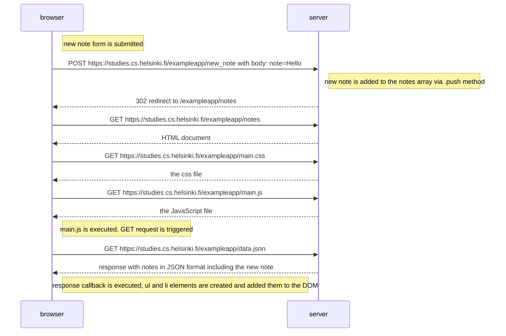

```mermaid
sequenceDiagram
    participant browser
    participant server

    Note right of browser: new note form is submitted

    browser->>server: POST https://studies.cs.helsinki.fi/exampleapp/new_note with body: note=Hello

    Note right of server: new note is added to the notes array via .push method

    server-->>browser: 302 redirect to /exampleapp/notes

    browser->>server: GET https://studies.cs.helsinki.fi/exampleapp/notes
    server-->>browser: HTML document

    browser->>server: GET https://studies.cs.helsinki.fi/exampleapp/main.css
    server-->>browser: the css file

    browser->>server: GET https://studies.cs.helsinki.fi/exampleapp/main.js
    server-->>browser: the JavaScript file

    Note right of browser: main.js is executed, GET request is triggered

    browser->>server: GET https://studies.cs.helsinki.fi/exampleapp/data.json
    server-->>browser: response with notes in JSON format including the new note

    Note right of browser: response callback is executed, ul and li elements are created and added them to the DOM
```
