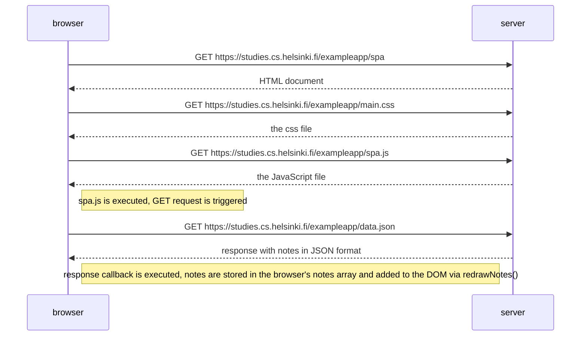

```mermaid
sequenceDiagram
    participant browser
    participant server

    browser->>server: GET https://studies.cs.helsinki.fi/exampleapp/spa
    server-->>browser: HTML document

    browser->>server: GET https://studies.cs.helsinki.fi/exampleapp/main.css
    server-->>browser: the css file

    browser->>server: GET https://studies.cs.helsinki.fi/exampleapp/spa.js
    server-->>browser: the JavaScript file

    Note right of browser: spa.js is executed, GET request is triggered

    browser->>server: GET https://studies.cs.helsinki.fi/exampleapp/data.json
    server-->>browser: response with notes in JSON format

    Note right of browser: response callback is executed, notes are stored in the browser's notes array and added to the DOM via redrawNotes()
```
