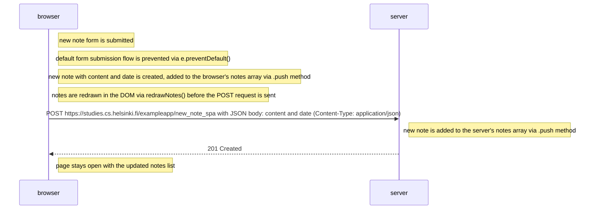

```mermaid
sequenceDiagram
    participant browser
    participant server

    Note right of browser: new note form is submitted

    Note right of browser: default form submission flow is prevented via e.preventDefault()

    Note right of browser: new note with content and date is created, added to the browser's notes array via .push method

    Note right of browser: notes are redrawn in the DOM via redrawNotes() before the POST request is sent

    browser->>server: POST https://studies.cs.helsinki.fi/exampleapp/new_note_spa with JSON body: content and date (Content-Type: application/json)

    Note right of server: new note is added to the server's notes array via .push method

    server-->>browser: 201 Created

    Note right of browser: page stays open with the updated notes list
```
